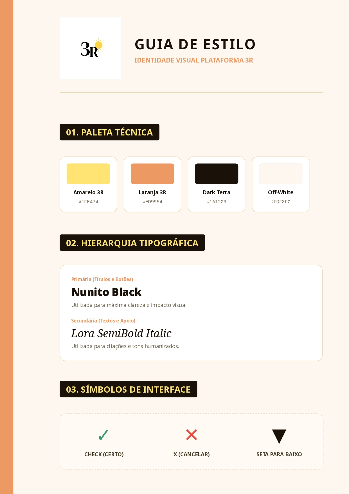
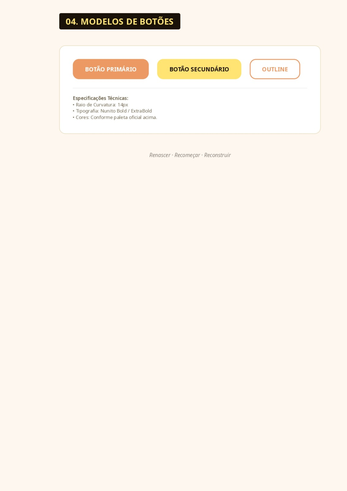

<h1 align="center">🌅 3R - RECOMEÇAR, RECONSTRUIR E RENASCER</h1>

  

✨ Um novo começo, uma nova história ✨

 

<h3>📖 <strong>Texto Introdutório do Projeto</strong></h3>

O processo de reinserção social de egressos do sistema prisional no Brasil apresenta desafios significativos, especialmente no que se refere ao acesso ao mercado de trabalho e à qualificação profissional. Após o cumprimento da pena, espera-se que esses indivíduos reconstruam suas trajetórias em liberdade; no entanto, fatores como o estigma social, a baixa escolaridade e a escassez de oportunidades dificultam esse recomeço, contribuindo para a manutenção de ciclos de exclusão e vulnerabilidade.

Diante desse cenário, torna-se necessário o desenvolvimento de iniciativas que promovam a inclusão social e visem auxiliar na ampliação da divulgação de possibilidades de inserção desses indivíduos no meio profissional. Nesse contexto, surge o projeto <strong>3R — Recomeçar, Reconstruir e Renascer</strong>, que tem como objetivo propor uma ferramenta tecnológica que pretende apoiar egressos do sistema prisional em seu processo de reintegração ao mercado de trabalho.

 

<h3>🎯 Objetivo Geral</h3>

Analisar e propor uma ferramenta tecnológica que auxilie na reinserção social de egressos do sistema prisional ao mercado profissionalizante, por meio do desenvolvimento de uma plataforma digital que contribua com o acesso a informações como: oportunidades de emprego, qualificação profissional e elaboração de currículos.

 

<h3>📌 Objetivos Específicos</h3>

✔️ Desenvolver uma interface web que permita a navegação entre as páginas da plataforma;  
✔️ Integrar informações retiradas da Constituição Brasileira sobre os direitos básicos dos egressos e daqueles que ainda estão privados de liberdade à estrutura informativa do site;  
✔️ Disponibilizar um sistema de cadastro voltado a administradores, empresas e egressos, visando à integração entre oferta e busca de oportunidades;  
✔️ Implementar uma funcionalidade para criação e download de currículos, permitindo que os usuários elaborem seus próprios documentos profissionais;  
✔️ Estruturar uma página de vagas de emprego com possibilidade de cadastro e atualização por empresas;  
✔️ Organizar uma página de formação profissional com cursos gratuitos, categorizados por área de interesse. 

 

<h3>💻 Tecnologias Utilizadas</h3>

  
  
  
  
  
  
  
  

 

<h3>🎨 Guia de Estilos</h3>

  

<h3><strong>🎨 Cores do Projeto e Logo</strong></h3>

As cores são: Preto, Branco, Amarelo e Laranja. 
A paleta visual equilibra o preto e branco, que conferem seriedade e contraste, com o laranja e o amarelo, tons que simbolizam acolhimento, transformação e o brilho de um novo recomeço, além das cores trazerem referência ao principal símbolo do projeto: o sol.

A logo é composta por um 3 e um R, que juntos simbolizam as três palavras que compõem o processo de reinserção social: <strong>Recomeçar</strong>, que simboliza a iniciativa de tentar de novo e não desistir; <strong>Reconstruir</strong>, que dialoga com a ideia de construir a própria vida do zero; e a mais importante delas: <strong>RENASCER</strong>, uma palavra que mostra o abandono de uma antiga realidade e o nascimento de um novo ser, frequentemente pintada nas paredes dos presídios.

 

O símbolo escolhido para a logo e consequentemente para representar o projeto foi um <strong>SOL 🌞</strong>, que representa a clareza de um novo horizonte e o calor do acolhimento. Assim como o amanhecer encerra a escuridão da noite, o sol simboliza o recomeço ininterrupto e a capacidade de cada indivíduo de voltar a brilhar na sociedade, iluminando caminhos que antes pareciam invisíveis.

 

<h3>📱 Redes Sociais</h3>

📸 Instagram: <a href="https://instagram.com/pro_jeto3r">@pro_jeto3r</a>

 

<h3>👥 Membros da Equipe e Responsabilidades</h3>

<strong> Camilly:</strong> (Front-end Developer) — Responsável por transformar o design em código vivo, garantindo que o site seja responsivo e acessível em qualquer tela.   

<strong> Guilherme Fontana:</strong> (Back-end Developer) — Responsável pela "engrenagem" do site, cuidando do banco de dados dos egressos.   

<strong> Rhuan:</strong> (UI/UX Design) — Criou a identidade visual, o símbolo do sol e a paleta de cores (laranja/amarelo) que guia a experiência do usuário e escolherá os ícones, fontes e estética do site.

 

<h3>📅 Data de Criação do Projeto</h3>

05/03/2026

 

<h3>📄 Documentação</h3>

📌 <strong>Pré-Projeto:</strong> 
<a href="pre-projeto-tcc-3r.pdf">📥 Baixar PDF</a>

📌 <strong>Documento de Requisitos:</strong> 
<a href="documento_de_requisitos.docx.pdf">📥 Baixar PDF</a>

